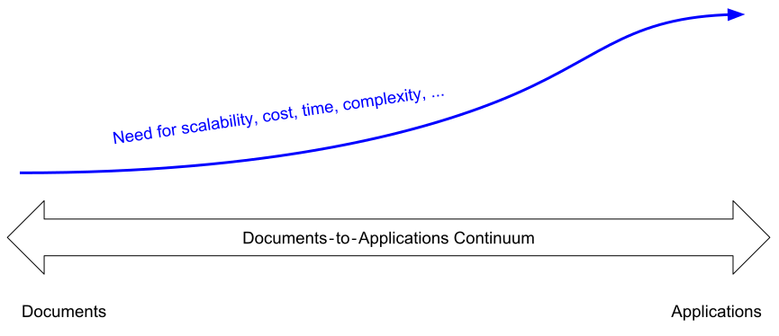
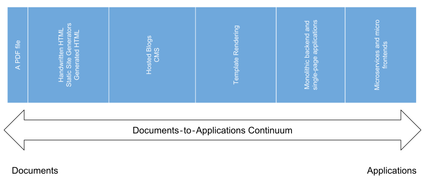
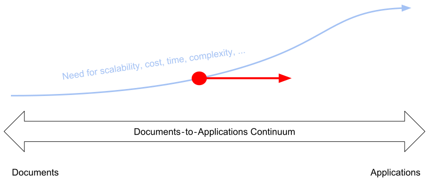
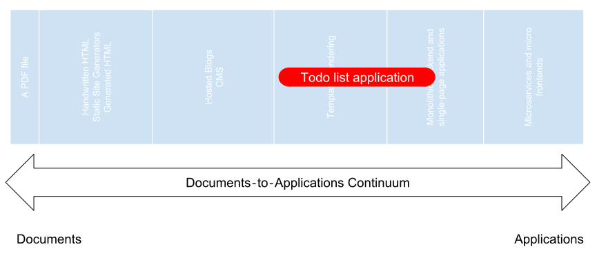
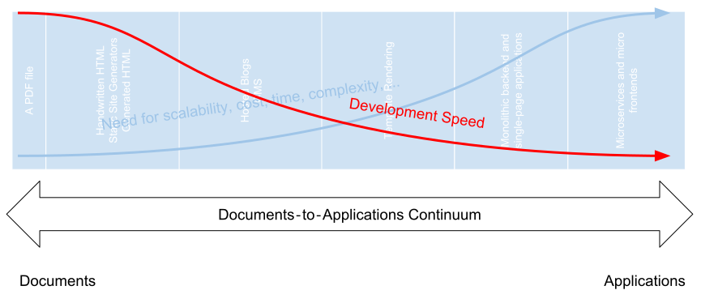
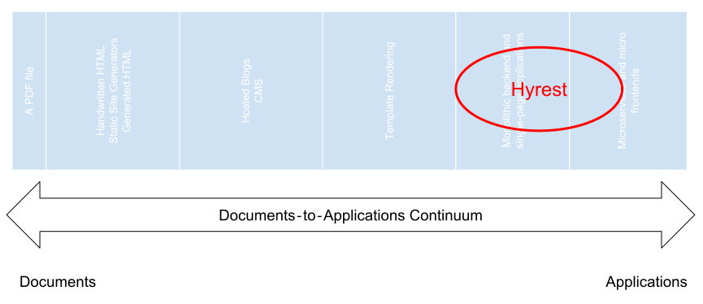

## The Documents‐to‐Applications Continuum

[Aral Balkan](https://2018.ar.al/) suggests to arrange web sites along the **[Documents‐to‐Applications Continuum](https://2018.ar.al/notes/the-documents-to-applications-continuum/)**.

On the left side of the continuum static and completely non-interactive documents (such as this guide), which are basically glorified ebooks, reside.
The right side of the continuum belongs to super interactive applications such as for example fancy browser games, music players, maps, etc.

### Visualization

By figuring out where inside this continuum a project lives, selecting the correct stack for it can be made much easier.

## Choosing the correct stack

Selecting the correct stack can be made easier by paying attention to the position of the project in the [Documents‐to‐Applications Continuum](https://2018.ar.al/notes/the-documents-to-applications-continuum/).
It might not always deliver an exact answer, but in general, can make the decision for the correct stack much easier.

### Exemplary Visualization

Static HTML pages, static site generators or sites generated by interactive editors commonly go along with **Documents**.
Their name already somewhat implies that. It might not be the best decision to start a full-blown React-project with a custom CSS framework
just to publish a library's documentation or a small business's company website. A static site generator, a bit of handwritten HTML or a [Wordpress](https://en.wikipedia.org/wiki/WordPress) Installation
might be (more than) sufficient for that.

On the other hand developing the next social network or exciting AAA 3D online browser free-to-play MMO shooter using
[Microsoft Frontpage](https://en.wikipedia.org/wiki/Microsoft_FrontPage) sounds pretty ridiculious. For those use-cases a Single-page application,
perhaps with a set of [microservices](https://en.wikipedia.org/wiki/Microservices) instead of a [monolithic backend](https://en.wikipedia.org/wiki/Monolithic_application), or even a set of [micro frontends](https://micro-frontends.org/)
talking to a set of [microservices](https://en.wikipedia.org/wiki/Microservices) arranged as [domain-specific verticals](https://dev.otto.de/2015/09/30/on-monoliths-and-microservices/) could be considered.

Sometimes, projects fall into one of these extremes, but often they might be better off with a solution somewhere in-between.
If your project can be realized with a simple [HTML form](https://en.wikipedia.org/wiki/HTML_element#Forms), [Bootstrap](https://getbootstrap.com/) and a [PHP](http://php.net/) backend on a weekend, why bother [getting frustrated
with modern JS web-development](https://hackernoon.com/how-it-feels-to-learn-javascript-in-2016-d3a717dd577f).

### As your project develops

This all sounds rather easy, right? Locate project in continuum, choose stack, perhaps set up a project using [PHP](http://php.net/), [HTML forms](https://en.wikipedia.org/wiki/HTML_element#Forms),
[Bootstrap](https://getbootstrap.com/) and [jQuery](https://jquery.com/), implement the thing on one weekend and life happily ever after? 

The sad thing is, that [products are undergoing a lifecycle](https://en.wikipedia.org/wiki/Product_lifecycle) as they are being developed and maintained, and for some (if not most) software projects,
this lifecycle might never come to an end. While growing, your project will increase in complexity, new features will be added, technologies will get outdated and so on.

Your project might move to the right (application) side of the spectrum, but will likely never (naturally) move to the left side and decrease in complexity (except you decide to close
the comment-section of your newspaper due spam-bots or remove features of apps because nobody uses them).

So while deciding for a stack, it is important to not only consider the [minimum viable product](https://en.wikipedia.org/wiki/Minimum_viable_product), but think about the scope it might some day need to extend to.

Something template-rendered might be suitable to [implement a simple TODO-List application](http://todomvc.com/), but after a while your users might express the need for autocompletion or a or cooperative lists or live updates or a gesture-controlled interface or notifications, etc.

And while I am sure that a [jQuery plugin](https://www.npmjs.com/search?q=keywords:jquery-plugin)
exists for every single of these needs, with each one your application gets more heavy-weight and at some point, you might have been better off with a single-page application and a
[REST Api](https://en.wikipedia.org/wiki/Representational_state_transfer) than a template rendered solution.

One solution could be to take a look at the stacks in the continuum and take the right most solution. But while this might be the most scalable one, it might seriously harm your initial development speed.

But when underestimating the necessary stack to carry the project through its lifecycle and realizing halfway through the project that it needs a fundamental stack change,
heavy refactorings and rewritings might become necessary.

## Conclusion 

There is no definitive answer. No *one stack to rule them all*. Hyrest or even single-page applications at all might not be the correct choice for your project.

This guide and Hyrest itself aim to provide utilities, patterns and design principles for applications too large for template rendering but small enough for utilizing microfrontends.
And even when targeting these scales, many solutions for implementing backends in other, more domain-specific languages exist.
Explore existing solutions carefully before writing your backend [in Javascript](https://www.google.com/search?q=don%27t+use+node.js&oq=don%27t+use+node.js), or any specific stack, actually.

