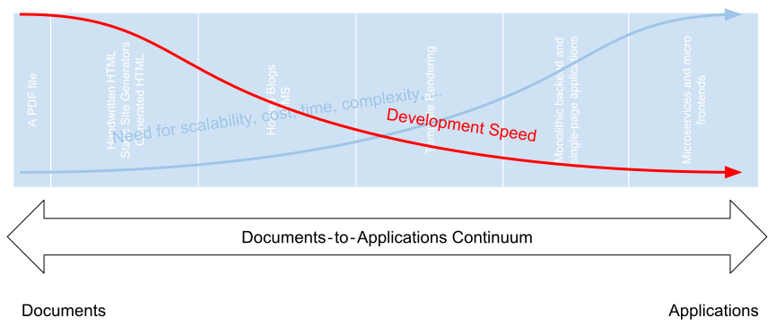
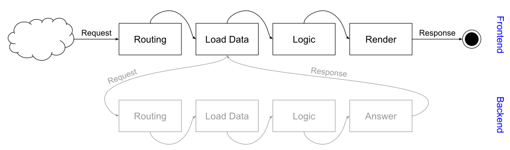

## Drawbacks of a complex stack

Why is it generally not a good idea to implement everything using the most complex and scalable stack available?

When recalling the [Documents-to-Applications Continuum](document-application), why not just take the stack right-most side in the continuum?
This way the project's stack could scale beyond the sales team's wildest dreams and the architecture will surely withstand all future needs and technological progressions.

With an increase of scalability (and complexity), the development speed, cost of developers, required skills and management overhead will always increase.

The reason for this are problems like

- Splitting an application into multiple sub applications will lead to code duplication and [implementational overhead](#implementational-overhead).
- [Using different technologies](#using-different-technologies) across the project's landscape will require developers able to understand the basics of some (if not all) of these technologies.
- Maintaining [dependencies between sub-projects](#dependencies-between-sub-projects) or to third-party projects can be cumbersome.
- [Deployment and operating](#deployment-and-operating) of more complex systems will get more cost-intensive and problem-prune.
- The bigger the project's landscape, the more possible [security](#security) vulnerabilities have to be taken into account.
- ...

### Implementational overhead

Why are template rendered solutions such as simple [PHP](https://php.net/) applications so much faster to develop [compared to single-page applications](https://adamsilver.io/articles/the-disadvantages-of-single-page-applications/)?

Because everything lives in one integrated project. The frontend is template-rendered from an application in one codebase, a call to the database is simply a call to a function or a method on an instance.

When writing a separate frontend application or even a set of multiple applications, there will be a gap somewhere between the interfaces presented to the user and the data which is being presented.

In a template rendered solution, only few steps are necessary to display a page. Let's say a user in a social-network application requested another user's profile page (`app.example.com/user/other`).

In a template rendered solution, the necessary steps to display the profile page would roghly be something like this:

1. Perform routing (`app.example.com/user/:username`) and parse the username from the URL.
2. Grab the data about user "other" from the database
3. Perform business logic and derive the data needed for the template to be rendered.
4. Fill out the template `
<h1>User {{$username}}</h1> ...` and send the result back to the browser.

While with a single-page application approach this will look a bit more complicated:

1. Perform routing (`app.example.com/user/:username`) and parse the username from the URL.
2. Call the backend and load the data (`api.example.com/user/:username`).
    1. Perform routing (`api.example.com/user/:username`) and parse the username from the URL.
    2. Grab the data about user "other" from the database
    4. Perform business logic, security checks and so an to derive the data which is returned to the frontend.
    3. Return a JSON structure with the user's data.
3. Perform business logic and derive the data needed for the template to be rendered.
4. Render a template `
<h1>User {{$username}}</h1> ...` to the DOM.

Essentially, the implementational effort has doubled. The frontend needs to do loading of data from the backend, perform business logic and generate the DOM content. The backend needs to do the same.

While performing the network request towards the backend often is just overhead which can be abstracted or autogenerated (but will never completely vanish), often tasks like validation or other business logic will be duplicated between the frontend and backend application.

In addition to logic and interfacing overhead, (mental) abstractions such as classes or interfaces for objects will also be duplicated between the backend and frontend part of the project.

### Using different technologies

With an increased system landscape the number of used technologies and the diversity of the stack will increase.
Even when having specialized teams for each sub-application which can deal with its own stack well, the overall maintainability of the application will decrease.
When the project eventually goes into a passive maintenance phase and the number of developers is reduced, each developer will need to be experienced in more technologies or more developers will be needed.
Even while still actively developing the application, there will be need for interoperability, general overview and understanding of the whole system's landscape.

### Dependencies between sub-projects

When dealing with multiple sub-projects, these project will have to somehow interface with each other and hence depend on each other. These kind of dependencies need to be closely watched and governed. For example breaking changes in the backend's Api need to be dealt with, communication needs to be performed and the migration of all depending sub-projects needs to be coordinated.

### Deployment and operating

The bigger the system landscape and the more services with diverse stacks are active, the more complicated deployment and operating will get. Different containers for all sub-rpoject stacks need to be developed and maintained, services need to be stopped and started in the correct order, ingress needs to be controlled and so on. Classic template rendered systems such as CGI systems simply need a webserver plugin for your language and you are ready to go.

### Security

With a growing landscape of services the number and scale of interfaces will grow. And with each added interface the potential for security vulnerability will grow. While classical solutions might not at all expose any internal Apis to the outside world, for example single-page applications heavily rely on a fully published (and hence potentially fully vulnerable) Api shared across services.

## So why bother?

While a set of sub-projects surely adds to the project's complexity and introduces a set of problems it solves some of the most fundamental problems in modern software development:

- **Scalability.** A set of services (even only a frontend separated from the backend) is much more scaleable than a monolith.
- **Domain specific solutions.** Using multiple services allows to utilize the best technology for each use case, as long as all services fall back to a common Api.
- **Expert Teams.** When developing a large application different experts might be needed. You might for example have a team of data scientists running your classifications, an AI expert developing an AI consuming your classified data, a team for the frontend, closely cooperating with Design and UX, and so on. Splitting your project into multiple sub-project can help your teams to stay independent and fast.
- **Deprecated components.** Over time, the used technologies of parts of your application will become deprecated. This is most commonly the case in the user-facing presentation tier. Designers tend to refurbish the design every other year and UX is a process which is never finished. It is much easier to replace individual sub-projects than replacing parts of a monolithic application.

## Conclusion

Giving up a traditional stack with a monolithic backend generating a frontend using template rendering and splitting your application into individual services introduces a set of problems. While introducing new problems, at the same time a set of fundamental problems of many projects can be solved using this approach.
