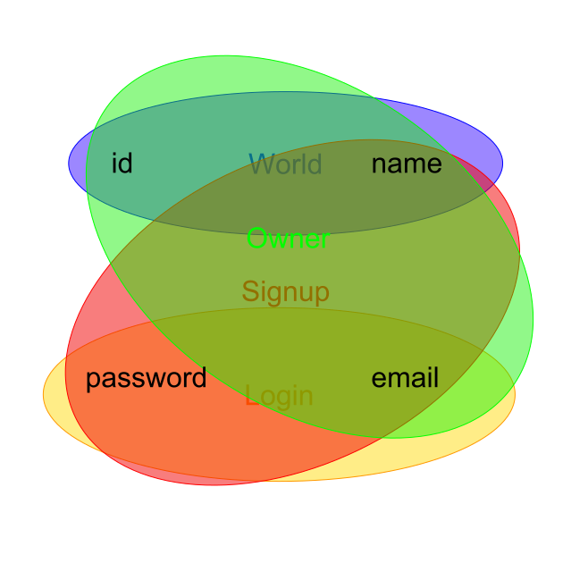

To understand Hyrest better, for learning by example or to evaluate it, example can proove helpfull.

## Realworld examples

Some opensource projects have been based on Hyrest:

- [Go3](https://github.com/Prior99/go3), a progressive web application for playing the boardgame "Go".
- [Mumble Bot](https://gitlab.com/prior99/mumble-bot), a bot for the voice-char software "Mumble".
- [Monday](https://gitlab.com/prior99/monday), a software for generating random words for games like "Charade".

## Fullstack Todo Example

Follow along this tutorial and write a Todo Example application on your to get your hands dirty with Hyrest.
The example will be published as a git repository on Github with commits for every step.

### 1. Basic setup

Initialize your project using [npm](https://docs.npmjs.com/cli/init) or [yarn](https://yarnpkg.com/en/docs/cli/init):

```sh
yarn init .
```

Add the following dependencies:

- `body-parser`: Express needs it to parse JSON.
- `express`: For serving the backend.
- `hyrest-express`: For connecting Hyrest to Express.
- `hyrest`
- `mobx-react`: For connecting MobX to React.
- `mobx`: As statemanagement in the frontend.
- `pg`: Postgres backend for Typeorm.
- `react-dom`: React backend for the browser's DOM.
- `react`: As rendering framework.
- `tsdi`: Dependency injection.
- `typeorm`: The suggested ORM.

And the following development dependencies:

 - `@types/body-parser`
 - `@types/express`
 - `@types/node`
 - `@types/react`
 - `ts-loader`: Loading typescript from webpack.
 - `ts-node`: For quickly starting the backend. Don't use this in production.
 - `typescript`: For compiling Typescript to Javascript.
 - `webpack-cli`
 - `webpack-dev-server`:
 - `webpack`: For compiling the frontend into a bundle.

```sh
yarn add body-parser express hyrest-express hyrest mobx-react mobx pg react-dom react tsdi typeorm && yarn add @types/body-parser @types/express @types/node @types/react ts-loader ts-node typescript webpack-cli webpack-dev-server webpack 
```

Initialize a git repository and push it to the remote location:

```sh
git init .
echo "node_modules/" >> .gitignore
git add package.json yarn.lock .gitignore
git commit -m "Initial commit"
git remote add origin git@github.com:Prior99/hyrest-todo-example.git
git push -u origin master
```

### 2. Create models

I suggest to get inspiration by drawing some UI sketches but designing your application from bottom to top. Hence in this tutorial we will start with the database models.

```sh
mkdir -p src/common/models
```

We will need entries for our Todo-List application so we have to define a model for it.
Think about what properties your model will have first.

#### Basic model

Our Todo entries will need a unique id, a name, a description. They will have been created at some point, can be checked and deleted.

Fire up your IDE and implement the class for the Todo model in `src/common/models/todo.ts`:

```typescript
export class Todo {
    public id?: string;
    public name?: string;
    public description?: string;
    public created?: Date;
    public checked?: Date;
    public deleted?: Date;
}
```

#### Typeorm decorators

Following the [Typeorm guide](http://typeorm.io/), annotate the class with decorators:

```typescript
import { Column, PrimaryGeneratedColumn, Entity, CreateDateColumn, UpdateDateColumn } from "typeorm";

export class Todo {
    @PrimaryGeneratedColumn("uuid")
    public id?: string;

    @Column("varchar", { length: 128 })
    public name?: string;

    @Column("text")
    public description?: string;

    @CreateDateColumn()
    public created?: Date;

    @Column("timestamp without time zone", { nullable: true })
    public checked?: Date;

    @Column("timestamp without time zone", { nullable: true })
    public deleted?: Date;
}
```

#### Hyrest decorators

We will be using the model for both the database as the controllers, so let's add some Hyrest decorators providing us with validation.

```typescript
import { Column, PrimaryGeneratedColumn, Entity, CreateDateColumn, UpdateDateColumn } from "typeorm";
import { is, specify, length, uuid } from "hyrest";

export class Todo {
    @PrimaryGeneratedColumn("uuid")
    @is().validate(uuid)
    public id?: string;

    @Column("varchar", { length: 128 })
    @is().validate(length(0, 128))
    public name?: string;

    @Column("text")
    @is()
    public description?: string;

    @CreateDateColumn()
    @is() @specify(() => Date)
    public created?: Date;

    @Column("timestamp without time zone", { nullable: true })
    @is() @specify(() => Date)
    public checked?: Date;

    @Column("timestamp without time zone", { nullable: true })
    @is() @specify(() => Date)
    public deleted?: Date;
}
```

We need to use `@specify(() => Date)` for the three properies having `Date` as type. Is is a special case only needed for `Date` and when two classes import each other in a circular way.

The `DataType` can be omitted from every `@is()` as Hyrest can infer them automatically from Typescript's reflection metadata Api.

#### Scopes

Currently, we defined how to save and load the model from the database and how to validate its schema.
It is also necessary to define "Scopes", as depending of the use-case and the permissions of the user, different fields will be allowed.

Create a file `src/common/scopes.ts` with the following content:

```typescript
import { createScope } from "hyrest";

export const world = createScope();
export const createTodo = createScope();
```

This defines two scopes: `world` and `createTodo`. The world scope should be contain all properties readable by the world.
The other scope is for creating a new todo. It will only contain `name` and `description`, as all other fields will be filled out by the controller.

```
import { Column, PrimaryGeneratedColumn, Entity, CreateDateColumn, UpdateDateColumn } from "typeorm";
import { is, specify, length, uuid, scope } from "hyrest";
import { createTodo, world } from "../scopes";

export class Todo {
    @PrimaryGeneratedColumn("uuid")
    @is().validate(uuid) @scope(world)
    public id?: string;

    @Column("varchar", { length: 128 })
    @is().validate(length(0, 128)) @scope(world, createTodo)
    public name?: string;

    @Column("text")
    @is() @scope(world, createTodo)
    public description?: string;

    @CreateDateColumn()
    @is() @specify(() => Date) @scope(world)
    public created?: Date;

    @Column("timestamp without time zone", { nullable: true })
    @is() @specify(() => Date) @scope(world)
    public checked?: Date;

    @Column("timestamp without time zone", { nullable: true })
    @is() @specify(() => Date) @scope(world)
    public deleted?: Date;
}
```

We assigned `createTodo` the properties `name` and `description`. For now there are no private properties, so all properties are included in the `world` scope.

You can think of scopes as different circles in a [Venn-Diagram](https://en.wikipedia.org/wiki/Venn_diagram).
In the following example, a model for a basic user with email, name, password and id exists:



Four scopes have been defined on it:

- **World**: Public access should only be granted to **id** and **name**.
- **Signup**: When signing up, the user needs to input **email**, **name**, and **password**.
- **Login**: The user will login with **email** and **password**.
- **Owner**: The user can load his own user, but the password is never transmitted, hence this scope contains **email**, **id** and **name**.

### 3. Add a controller

The model only defines the shape of the data to store. In order to do something with it, we need a controller.
It can be a good pattern to create one controller per model and supply the basic [CRUD operations](https://en.wikipedia.org/wiki/Create,_read,_update_and_delete).

Let's create a controller for dealing woth Todo models. Creating a controller is as simple as creating a new class and decorating it with `@controller`.

Add an empty decorated class in `src/common/controllers/todos.ts`:

```typescript
import { controller } from "hyrest";

@controller
export class TodosController {

}
```

For now, operations for creating, deleting, listing and checking todos should suffice.
The operation for creating a new todo will take a "prototypical" todo as argument.
As we made all properties on the `Todo` class optional earlier, we can simply use `Todo` as interface.

*I tend to create `index.ts` files simply proxy-exporting everything from within the same directory to keep the governance of the nested directory structure independent.
Create a `index.ts` file inside `src/common/models` and add `export * from "./todo";` to it, or import the model directly from the `todo.ts` file.*

After creating all methods, the controller should look like this:

```typescript
import { controller } from "hyrest";
import { Todo } from "../models";

@controller
export class TodosController {
    public create(todo: Todo) {
    }

    public list() {
    }

    public remove(id: string) {
    }

    public check(id: string) {
    }
}
```

In order to make the methods callable via REST, we need to decorate them with `@route`:

```typescript
import { controller, route } from "hyrest";
import { Todo } from "../models";

@controller
export class TodosController {
    @route("POST", "/todos")
    public create(todo: Todo) {
    }

    @route("GET", "/todos")
    public list() {
    }

    @route("DELETE", "/todo/:id")
    public remove(id: string) {
    }

    @route("POST", "/todo/:id/check")
    public check(id: string) {
    }
}
```

In addition to defining the routes, the parameters as for example the `:id` from the URL or the todo prototype in the `create` method need to be inject somehow.
For the URL parameters `@param` can be used, the body can be injected via `@body`.

```typescript
import { controller, route, body, param } from "hyrest";
import { Todo } from "../models";
import { createTodo } from "../scopes";

@controller
export class TodosController {
    @route("POST", "/todos")
    public create(@body(createTodo) todo: Todo) {
    }

    @route("GET", "/todos")
    public list() {
    }

    @route("DELETE", "/todo/:id")
    public remove(@param("id") id: string) {
    }

    @route("POST", "/todo/:id/check")
    public check(@param("id") id: string) {
    }
}
```

The arguments for the `@param("id")` decorators identify the part of the route defined in the corresponding `@route` decorator.
The scope `createTodo` is supplied to the `@body` decorator as only the properties within that scope are valid for this route.
