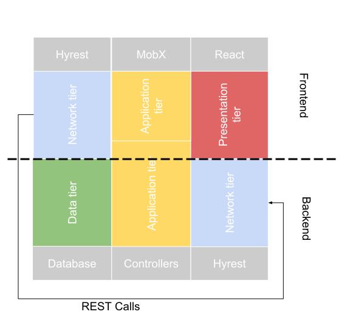

With all the problems denoted in [Drawbacks](drawbacks) and [existing solutions listed previously](existing-approaches), what role does Hyrest take?

## Motivation

Hyrest aims to keep the architecture of each application intact and tries to [not mix up the different tiers](anatomy#don-t-mix-up-the-tiers). While doing so, it still wants to bridge the gaps between sub-projects and make them essentially one (This is greatly inspired by the trend to use mono-repositories).

Calling the route of another service will be as easy as calling a method implemented in the same sub-project. Interfaces can be consistently shared between projects and logic can dynamically be re-used while still maintaining a consistent Api.

## Solutions

When thinking back about the target multitier architecture discussed in [Anatomy](anatomy), each application deserves its own three tiers, connected by a networking tier. Each application has its own presentation tier, the one of the backend being the REST Api consumed by the frontend:


Hyrest still honours this idea, but will allow the developers to share the backend application tier across all applications and autogenerating the networking tier:



Each application still has a data tier, an application tier and a presentation tier. But the frontend is able to reuse the backend's application tier transparently.

### Unifying the stack

When developing an application using Hyrest, you will implement your whole project (backend and frontend) in Typescript. It is of course possible to implement specialized services using other technologies, but Hyrest can't help you much here.

Personally, I recommend using a mono-repository with different domain-specific packages using Lerna and Yarn workspaces when dealing with more than one set of backend and frontent.

When implementing a set of one backend consumed by one frontend, a single project with two entry-points can be enough:

```text
project-root
├── src
│   ├── common
│   │   ├── controllers
│   │   │   ├── statistics-controller.ts
│   │   │   ├── user-controller.ts
│   │   ├── models
│   │   │   ├── user.ts
│   │   │   ├── statistics.ts
│   ├── server
│   │   ├── index.ts
│   ├── ui
│   │   ├── index.tsx
```

The code in `src/server` would be compiled for Node.JS and serve an Express backend, while webpack could compile `src/ui` into a web application bundle.

Code in both `src/server` and `src/ui` can access `src/common`, but they would never cross-reference each other.

### Aligning your teams correctly

Hyrest essentially merges separate sub-projects back into one project, while still keeping it different applications. This encourages teams to be split across specific domains of your project instead of having a dedicated frontend and a dedicated backend team (a team per services). A team can still consist of backend-experts and frontend-experts but by easing the access and inclusions between multiple sub-projects and unifying the stack no dedicated teams per service are necessary anymore.

### Bridging the networking gap

Hyrest is heavily decorator-oriented. Logic consuming data from the persistence tier should be implemented in controller classes decorated with a `@controller` decorator marking it as a controller. Each method that should be callable from any other sub-project has to be decorated with `@route("GET", "/route/to/resource")` and will hence be exposed as a REST route.

When calling such a method on a controller ...

- ... from within the backend itself, the actual method body is executed and no networking operation is performed. The `@route` annotation will be ignored. A simple method call will be performed.
- ... from the frontend, a HTTP request is forged as explained by the `@route` decorator. The request will be performed and the result will be returned.
- ... from a networking middleware (such as [hyrest-express](https://npmjs.com/hyrest-express)), the parameters will be injected into the method, the method will be called, the response will be wrapped and send back over the network.


Let's say the following logic needs to be executed to assemble a user's statistics in the backend which will be used in the frontend to render a neat chart:

```typescript
class StatisticsController {
    public async getStatistics(userId: string, month: number): Promise<Statistics> {
        const messages: Message[] = await database.query(`
            SELECT
                weekday,
                COUNT(message) as messageCount
            FROM message
            GROUP BY weekday
            WHERE userId = :userId AND month = :month
        `, userId, month);
        return messages.reduce((result, { weekday, messageCount }) => {
            return {
                [weekday]: messageCount,
                ...result
            };
        }, {});
    }
}
```

The same function is also used inside the backend internally, to present combined statistics for administrative purposes or logging.

Without Hyrest, you would probably keep this function separate, then wrap it in some express handler:

```typescript
app.get("/user/:userId/statistics", async (request, response) => {
    // TODO: Validate URL parameter `userId` and query parameter `month`.
    const statistics = await getStatistics(request.param.userId, Number(request.query.month));
    response.status(200).send(statistics);
});
```

In the backend you would call the `getStatistics` function manually and in the frontend something like this would be needed:

```typescript
class StatisticsApi {
    public async getStatistics(userId: string, month: number): Promise<Statistics> {
        const response = await fetch(`https://api.example.com/user/${userId}/statistics?month=${month}`);
        const body = await response.json();
        // Create a real instance of `Statistics` to gain acces to methods etc.
        const statistics = new Statistics();
        for (let key in body) {
            statistics[key] = body[key];
        }
        return statistics;
    }
}
```

While this is all quite overheady, the real problem is, that utility functions inside the backend might depend on `getStatistics` and hence can not be used inside the frontend.

Another problem is that developers might forget to wrap the response in a real `Statistics` instance or flood the project with new interfaces for the Api's responses, all expressing the same thing but with some fields missing, hence creating inconsistencies.

Hyrest will reduce the overhead to make you write only what really matters:

- The method's implementation.
- How the REST parameters are used.
- The call to the method.

```typescript
@controller
class StatisticsController {
    @route("GET", "/user/:userId/statistics")
    public async getStatistics(@param("userId") userId: string, @query("month") month: number): Promise<Statistics> {
        const messages: Message[] = await database.query(`
            SELECT
                weekday,
                COUNT(message) as messageCount
            FROM message
            GROUP BY weekday
            WHERE userId = :userId AND month = :month
        `, userId, month);
        return messages.reduce((result, { weekday, messageCount }) => {
            return {
                [weekday]: messageCount,
                ...result
            };
        }, {});
    }
}
```

The code for the backend is essentially the same, just some decorators were added:

- The `@controller` decorator denotes the class as a controller, which tracks important metadata and configuration.
- The `@route` decorator configures how the method can be accessed using REST.
- The `@param` and `@query` decorators will inject the URL and query parameters into the method.

Nothing more is necessary. In the frontend a simple `await statisticsController.getStatistics("my-user-id", 11)` will be enough. At the same time, it is still possible to perform a call to `https://api.example.com/user/my-user-id/statistics?month=11`.

When using utility functions inside the backend which call `StatisticsController.getStatistics`, the decorators are ignored and the method's logic is executed.

When using utility functions inside the frontend which call `StatisticsController.getStatistics`, the decorators are used to perform the REST call.

### Interfaces, schemas and validation

Apart from the networking gap, interfaces also need to be shared between applications. Let's say the following model is returned by the ORM utilized in the backend:

```typescript
class User {
    id: string;
    password: string;
    age: number;
    gender: "male" | "female";
}
```

One of Hyrests core principles is to introduce descriptive decorators which add additional metadata where it belongs. This metadata will later be consumed by who-ever needs it.

In this example, as well when implementing a form for signup in the frontend as when validating an incoming request in the backend, metadata about datatype, password validity and so on is needed.

Validation without Hyrest could naively be implemented with a function like this:

```typescript
function validateUser(user: any): boolean {
    if (typeof user.id !== "string") { return false; }
    if (typeof user.password !== "string" || user.password.length < 8) { return false; }
    if (typeof user.age !== "number" || parseInt(user.age) !== parseFloat(user.age)) { return false; }
    if (user.gender !== "male" && user.gender !== "female") { return false; }
    return true;
}
```

However, this does not yet handle deserialization of URL parameters, creation of real `User` instances from JSON objects, emitting of error messages for debugging etc.

Traditionally, without using any libraries, this would all needed to be implemented in addition to `validateUser` and basically express the same thing.

Hyrest utilizes a set of descriptive decorators for this:

```typescript
class User {
    @is(DataType.string).validate(uuid)
    id: string;
    @is(DataType.string).validate(length({ min: 8 }))
    password: string;
    @is(DataType.int)
    age: number;
    @is(DataType.string).validate(oneOf(["male", "female"]))
    gender: "male" | "female";

    public get isLikelyDead() { return this.age > 120; }
}
```

*Please note that the `DataType.string` part can be omitted as Hyrest can infer it from the Typescript typings.*

These decorators do nothing but add additional metadata to the class which will later be consumed by [hyrest-express](https://www.npmjs.com/package/hyrest-express) for validation and parsing of incoming requests or [hyrest-mobx](https://www.npmjs.com/package/hyrest-mobx) for frontend-validation.

The same class can later be used for the backend's ORM to save an instance of `User` to the database, serialize and deserialize REST calls, and handle `User` instances in both the backend and the frontend.
