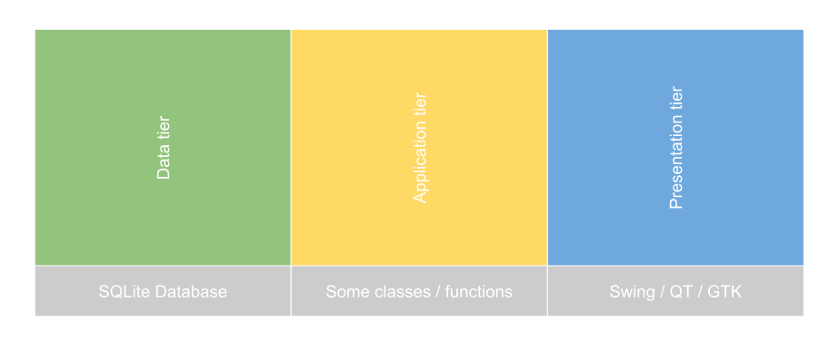
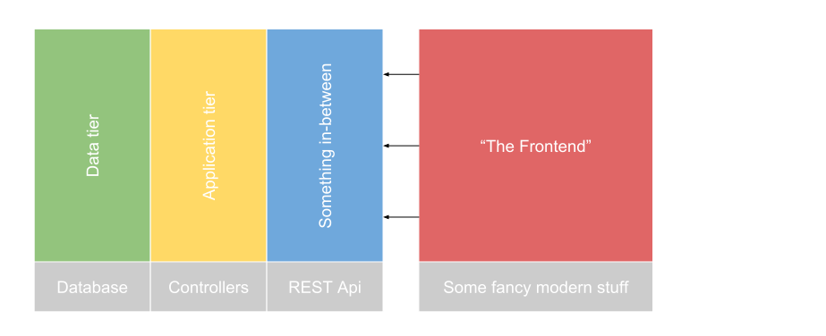
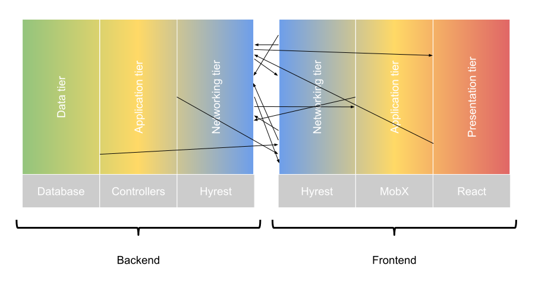

An architecture that has been around for a while is the [Multitier Architecture](https://en.wikipedia.org/wiki/Multitier_architecture#Three-tier_architecture).

## Multitier Architecture

A simple three-tier project might be (roughly) divided into:

- Data tier
- Application tier
- Presentation tier

### Simple example

In a minimal desktop application (perhaps written in C++ and [QT](https://www.qt.io/), [GTK](https://www.gtk.org/) or [Java Swing](https://docs.oracle.com/javase/tutorial/uiswing/), this might be all you need.
Setup an [SQL](https://www.sqlite.org/index.html) database and connect it to your project using your favorite [ORM](introduction-architectural-inspirations.md#use-an-orm) (Data tier), implement some classes or functions containing your business and application logic (Application tier), draw a nice GUI in your favorite editor (Presentation tier), connect it to the application tier and you're done.

### Multitier in web applications

When developing a web application with a separate frontend using [REST](https://en.wikipedia.org/wiki/Representational_state_transfer) (or any other networking technology for exchanging information such as [GraphQL](https://graphql.org/)), the whole thing gets a bit more complicated.

How does the new multitier architecture look like now?

The presentation tier is now *the frontend* and no changes are made to the application tier and the data tier.
Between the *the frontend* and the application tier something exposing the API has to exist.
Naively, the model could look like this now:

This approach is a bit too simple.

> This is actually a common problem in many modern projects I have worked on in the past.
> Often, the frontend part of any project fails because the architectural effort is underestimated.

The frontend is its own application, separated from the backend and hence deserves its own three-tier architecture.
The backend still has a presentation tier, just not one which is exposed to a user.
Instead, the backend's presentation tier exposes an API.
When thinking about your API as being a presentation tier, it becomes obvious to keep it well-documented, clean and consistent (Just as a user interface would be).

The frontend itself will not have a data tier per se, but a tier consuming the backend's presentation tier (the exposed API).
The frontend can still keep and cache data for form-resubmission, rendering lists, tables and so on, but this falls under the governance of its application tier.

In a single-page application the architecture could be visualized like this:

### Summary

Of course, visualizing an application's anatomy as a set of tiers will explain only a small aspect of it and is by no means sufficient, but it is a good starting point for re-thinking the structure of modern web applications.

## Sub applications

When developing a project with multiple sub applications (e.g. backend and frontend), each application should be treated as a first-class citizen:

- Each sub application of your project, be it a monolithic backend consumed by a monolithic frontend or a set of micro-services consumed by multiple frontends deserves its own architecture.
- Each sub application has a presentation tier, and those interfaces should be treated just as well as a user interface.

### Don't mix up the tiers

Keep your tiers consistent.
Whenever implementing a new method, adding a new class or property, think whether it belongs where you're currently adding it to.

UI logic belongs into the presentation tier, business logic belongs in the application tier (of either the frontend or backend or both, think carefully) and so on.
When mixing up the tiers you risk building up technical debt and the project might become less readable.

> I always tend to ask myself: "If this was my first day on this project, where would I expect this to be?".

### Keep your API consistent

Even if a sub application (the backend) doesn't directly reach the end-user, the user experience should still be kept great: Invest into a consistent, well-documented API.
Don't implement specific routes for specific use cases by the frontend.
A maintainable API is the foundation of every project.

When developing a project with a separate team for the frontend and the backend, make sure the frontend team does not need to ask questions about your API.
If they do, document it.

> Keep the developer's user experience of dealing with your API just as well as the end-user's experience of dealing with the frontend.
> From what I learned, this will pay off in means of security, stability, scalability and maintainability.

When developing both frontend and backend in one team or alone, pretend you are two teams: One for the backend and one for the frontend, and ask yourself whether an addition
or modification to the backend's API makes sense in terms of the API's consistency and understandability, or if you are just being lazy.

## Conclusion

Each sub application (backend and frontend) deserve their own architecture and should expose consistent interfaces, be it a user interface or an interface between different applications.
