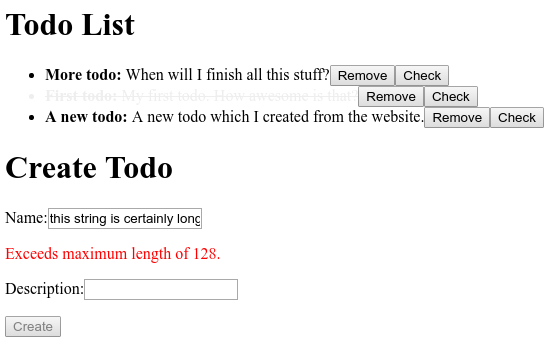

We can list todos, but how to create them?
Create a new component in `src/components/form.tsx` similar to the components you already created [in the previous section](tutorial-list-component):

## Basic component

```tsx
import * as React from "react";
import { external, inject } from "tsdi";
import { observer } from "mobx-react";
import { TodosStore } from "../store";

@external @observer
export class Form extends React.Component {
    @inject private todos: TodosStore;

    public render() {
        return (
            <form>
            </form>
        );
    }
}
```

## Add a field

The utility package [hyrest-mobx](https://www.npmjs.com/package/hyrest-mobx) provides a decorator for dealing with forms in a convenient way.

As described in the [package's README](https://www.npmjs.com/package/hyrest-mobx#usage), add a `@field` property to the component like so:

```tsx
import * as React from "react";
import { external, inject } from "tsdi";
import { observer } from "mobx-react";
import { field, Field, hasFields } from "hyrest-mobx";
import { Todo } from "../../common";
import { TodosStore } from "../store";

@external @observer @hasFields()
export class Form extends React.Component {
    @inject private todos: TodosStore;

    @field(Todo) private todo: Field<Todo>;

    public render() {
        const { name, description } = this.todo.nested;
        return (
            <form>
            </form>
        );
    }
}
```

This property will help us to perform validation, keep the intermediate state and so on.

## Input for the name

Adding an input for the name property is very simple.
Two-way binding for react is provided by [hyrest-mobx](https://www.npmjs.com/package/hyrest-mobx):

```tsx
public render() {
    const { name } = this.todo.nested;
    return (
        <form>
            <p>
                <label>
                    Name:
                    <input {...name.reactInput} />
                </label>
            </p>
        </form>
    );
}
```

For every property of our `Todo` model, the field (completely typesafe) contains a property on it's member `nested`.
For the field itself and for every sub-field (even with deeply nested fields), utilities for accessing the value,
updating it, validating it, etc. exist.

Here, we use the `reactInput` utility, which returns an object with `onChange` and `value` set on it.
This way, when spreading it onto the `<input />` field, two-way binding is achieved.

## Input for the description

Adding an input for the description property works the same way as with [the name property](#input-for-the-name).

```tsx
public render() {
    const { name, description } = this.todo.nested;
    return (
        <form>
            <p>
                <label>
                    Name:
                    <input {...name.reactInput} />
                </label>
            </p>
            <p>
                <label>
                    Description:
                    <input {...description.reactInput} />
                </label>
            </p>
        </form>
    );
}
```

## Validation

Both fields can in theory be invalid.
Let's render an error message when the validation failed:

```tsx
public render() {
    const { name, description } = this.todo.nested;
    return (
        <form onSubmit={this.handleSubmit}>
            <p>
                <label>
                    Name:
                    <input {...name.reactInput} />
                </label>
            </p>
            { name.invalid && <p style={{ color: "red" }}>{name.error}</p> }
            <p>
                <label>
                    Description:
                    <input {...description.reactInput} />
                </label>
            </p>
            { description.invalid && <p style={{ color: "red" }}>{description.error}</p> }
        </form>
    );
}
```

The property `invalid` will return `true` if the field itself or any nested field failed validation.
The `error` property will return the first error.
This is using the validation [defined on the model](tutorial-models) internally.

## Submit the form

In order to submit the form, an action with a button needs to be added.
The `TodosStore`'s `create()` method takes a `Todo` as argument.
The `Todo` can be retrieved from the field by using the `value` getter:

```typescript
@action.bound private async handleSubmit(event: React.SyntheticEvent<HTMLFormElement>) {
    event.preventDefault();
    await this.todos.create(this.todo.value);
}
```

Add an `onSubmit` handler to the `<form>` as well as a submit button which is disabled when any of the field's sub-fields are invalid:

```tsx
public render() {
    const { name, description } = this.todo.nested;
    return (
        <form onSubmit={this.handleSubmit}>
            <p>
                <label>
                    Name:
                    <input {...name.reactInput} />
                </label>
            </p>
            { name.invalid && <p style={{ color: "red" }}>{name.error}</p> }
            <p>
                <label>
                    Description:
                    <input {...description.reactInput} />
                </label>
            </p>
            { description.invalid && <p style={{ color: "red" }}>{description.error}</p> }
            <p>
                <input disabled={this.todo.invalid} type="submit" value="Create" />
            </p>
        </form>
    );
}
```

## Mount your form

Add your newly created form to your root markup in `src/web/index.tsx`:

```tsx
...

import { List, Form } from "./components";

...

ReactDOM.render(
    <div>
        <h1>Todo List</h1>
        <List />
        <h1>Create Todo</h1>
        <Form />
    </div>,
    document.getElementById("root"),
);
```

## Summary

Your whole form component should look like this:

```tsx
import * as React from "react";
import { external, inject } from "tsdi";
import { observer } from "mobx-react";
import { action } from "mobx";
import { field, Field, hasFields } from "hyrest-mobx";
import { Todo } from "../../common";
import { TodosStore } from "../store";

@external @observer @hasFields()
export class Form extends React.Component {
    @inject private todos: TodosStore;

    @field(Todo) private todo: Field<Todo>;

    @action.bound private async handleSubmit(event: React.SyntheticEvent<HTMLFormElement>) {
        event.preventDefault();
        await this.todos.create(this.todo.value);
    }

    public render() {
        const { name, description } = this.todo.nested;
        return (
            <form onSubmit={this.handleSubmit}>
                <p>
                    <label>
                        Name:
                        <input {...name.reactInput} />
                    </label>
                </p>
                { name.invalid && <p style={{ color: "red" }}>{name.error}</p> }
                <p>
                    <label>
                        Description:
                        <input {...description.reactInput} />
                    </label>
                </p>
                { description.invalid && <p style={{ color: "red" }}>{description.error}</p> }
                <p>
                    <input disabled={this.todo.invalid} type="submit" value="Create" />
                </p>
            </form>
        );
    }
}
```

You can now create, list, delete and check todos.


