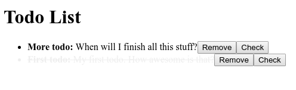

Let's display all todos as a list.
For this, we will create two components: One for the list items and one for the surrounding list.
Create a directory `src/web/components` for hosting all components.

## List item

Add a file `list-item.tsx` to `src/web/components`, which will hold our `<ListItem />` component.

### Basic React component

Add [a basic react component](https://reactjs.org/docs/react-component.html) to it and make it an [@observer](https://mobx.js.org/refguide/observer-component.html).

We need to inject our `TodosStore` into it, but we don't want it to be managed by TSDI. Hence, we have to decorate it with [@external](https://tsdi.js.org/docs/en/features.html#externals).

```tsx
import * as React from "react";
import { external, inject } from "tsdi";
import { observer } from "mobx-react";
import { TodosStore } from "../store";

@external @observer
export class ListItem extends React.Component {
    @inject private todos: TodosStore;


    public render() {
        return (
            <li>
            </li>
        );
    }
}
```

### A getter for the todo

As explained earlier, [keep the properties for your components as tidy as possible](introduction-architectural-inspirations#don-t-mix-up-markup-and-dataflow).

What do we need to render an item in the list? Only the id for the todo to render.
Add the property to the generic parameter of the extended class: `export class ListItem extends React.Component<{ id: string }> {`.

We will often have the use case of accessing the real todo, which we will have too look up in the injected store. Create a [@computed](https://mobx.js.org/refguide/computed-decorator.html) getter for this purpose:

```typescript
@computed private get todo() { return this.todos.byId(this.props.id); }
```

### Render the todo

It's now possible to render the todo by adding some markup to the `render()` method:

```tsx
import * as React from "react";
import { external, inject } from "tsdi";
import { observer } from "mobx-react";
import { computed } from "mobx";
import { TodosStore } from "../store";

@external @observer
export class ListItem extends React.Component<{ id: string }> {
    @inject private todos: TodosStore;

    @computed private get todo() { return this.todos.byId(this.props.id); }

    public render() {
        return (
            <li>
                <b>{this.todo.name}:</b> {this.todo.description}
            </li>
        );
    }
}
```

### Render checked todos

Currently, we have no way of seeing whether a todo was checked.
Add a [@computed](https://mobx.js.org/refguide/computed-decorator.html) getter for returning [inline styles](https://reactjs.org/docs/dom-elements.html#style) applied to the `<li>` element.

> In a real application you will probably want to use [styled components](https://www.styled-components.com/) or [CSS modules](https://github.com/css-modules/css-modules) instead of inline styles.

```tsx
...

@external @observer
export class ListItem extends React.Component<{ id: string }> {
    ...

    @computed private get style() {
        return {
            textDecoration: this.todo.checked ? "line-through" : undefined,
            color: this.todo.checked ? "#eee" : undefined,
        };
    }

    ...

    public render() {
        return (
            <li style={this.style}>
                <b>{this.todo.name}:</b> {this.todo.description}
            </li>
        );
    }
}
```

This will make the list item appear grey and strike through if a todo was checked.

### Checking a todo

Let us add a button for checking a todo.
For this we add a simple [@action](https://mobx.js.org/refguide/action.html) to the component which just calls `check()` on the injected store:

```typescript
@action.bound private async handleCheck() { await this.todos.check(this.todo.id); }
```

Add a button to the markup which call this method when clicked:


```tsx
<li style={this.style}>
    <b>{this.todo.name}:</b> {this.todo.description}
    <button onClick={this.handleCheck}>Check</button>
</li>
```

### Removing a todo

Let us add a button for removing a todo.
Add an action and update the markup like [above](#checking-a-todo).

```typescript
@action.bound private async handleRemove() { await this.todos.remove(this.todo.id); }
```

```tsx
<li style={this.style}>
    <b>{this.todo.name}:</b> {this.todo.description}
    <button onClick={this.handleRemove}>Remove</button>
    <button onClick={this.handleCheck}>Check</button>
</li>
```

### Summary

The list item component now looks like this:

```tsx
import * as React from "react";
import { external, inject } from "tsdi";
import { observer } from "mobx-react";
import { computed, action } from "mobx";
import { TodosStore } from "../store";

@external @observer
export class ListItem extends React.Component<{ id: string }> {
    @inject private todos: TodosStore;

    @computed private get todo() { return this.todos.byId(this.props.id); }

    @computed private get style() {
        return {
            textDecoration: this.todo.checked ? "line-through" : undefined,
            color: this.todo.checked ? "#eee" : undefined,
        };
    }

    @action.bound private async handleRemove() { await this.todos.remove(this.todo.id); }

    @action.bound private async handleCheck() { await this.todos.check(this.todo.id); }

    public render() {
        return (
            <li style={this.style}>
                <b>{this.todo.name}:</b> {this.todo.description}
                <button onClick={this.handleRemove}>Remove</button>
                <button onClick={this.handleCheck}>Check</button>
            </li>
        );
    }
}
```

It is capable of checking and removing its underlying todo item and renders differently when being checked.

## List

Add a file `list.tsx` to `src/web/components`, which will hold our `<List />` component.

Add [a basic react component](https://reactjs.org/docs/react-component.html) as you did with the [list item](#list-item).

[As above](#list-item) inject the `TodosStore` into it. Use the `all` getter we implemented and render a `<ListItem />` for every todo in the store:

```tsx
import * as React from "react";
import { external, inject } from "tsdi";
import { observer } from "mobx-react";
import { TodosStore } from "../store";
import { ListItem } from "./list-item";

@external @observer
export class List extends React.Component {
    @inject private todos: TodosStore;

    public render() {
        return (
            <ul>
                {this.todos.all.map(({ id }) => <ListItem id={id} key={id} />)}
            </ul>
        );
    }
}
```

Mount the `<List />` in the root react markup:

```tsx
...

import { List } from "./components";

...

ReactDOM.render(
    <div>
        <h1>Todo List</h1>
        <List />
    </div>,
    document.getElementById("root"),
);
```

## Summary

When loading the page and having a backend running which serves some todos (if not, create some as described [here](http://localhost:3000/hyrest/docs/tutorial-compile-backend#create-a-todo)), you should see a list like this one:

