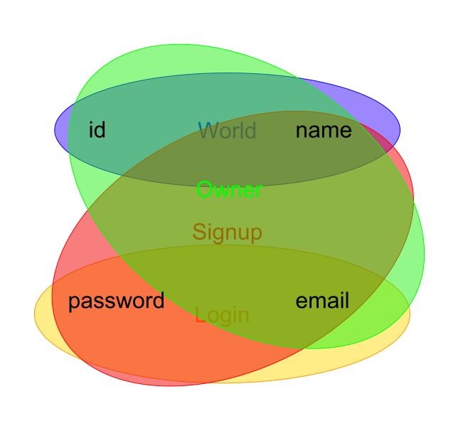

I suggest to get inspiration by drawing some UI sketches but designing your application from bottom to top. Hence in this tutorial we will start with the database models.

```sh
mkdir -p src/common/models
```

We will need entries for our Todo-List application so we have to define a model for it.
Think about what properties your model will have first.

## Basic model

Our Todo entries will need a unique id, a name, a description. They will have been created at some point, can be checked and deleted.

Fire up your IDE and implement the class for the Todo model in `src/common/models/todo.ts`:

```typescript
export class Todo {
    public id?: string;
    public name?: string;
    public description?: string;
    public created?: Date;
    public checked?: Date;
    public deleted?: Date;
}
```

## Typeorm decorators

Following the [Typeorm guide](http://typeorm.io/), annotate the class with decorators:

```typescript
import { Column, PrimaryGeneratedColumn, Entity, CreateDateColumn, UpdateDateColumn } from "typeorm";

export class Todo {
    @PrimaryGeneratedColumn("uuid")
    public id?: string;

    @Column("varchar", { length: 128 })
    public name?: string;

    @Column("text")
    public description?: string;

    @CreateDateColumn()
    public created?: Date;

    @Column("timestamp without time zone", { nullable: true })
    public checked?: Date;

    @Column("timestamp without time zone", { nullable: true })
    public deleted?: Date;
}
```

## Hyrest decorators

We will be using the model for both the database as the controllers, so let's add some Hyrest decorators providing us with validation.

```typescript
import { Column, PrimaryGeneratedColumn, Entity, CreateDateColumn, UpdateDateColumn } from "typeorm";
import { is, specify, length, uuid } from "hyrest";

export class Todo {
    @PrimaryGeneratedColumn("uuid")
    @is().validate(uuid)
    public id?: string;

    @Column("varchar", { length: 128 })
    @is().validate(length(0, 128))
    public name?: string;

    @Column("text")
    @is()
    public description?: string;

    @CreateDateColumn()
    @is() @specify(() => Date)
    public created?: Date;

    @Column("timestamp without time zone", { nullable: true })
    @is() @specify(() => Date)
    public checked?: Date;

    @Column("timestamp without time zone", { nullable: true })
    @is() @specify(() => Date)
    public deleted?: Date;
}
```

We need to use `@specify(() => Date)` for the three properies having `Date` as type. Is is a special case only needed for `Date` and when two classes import each other in a circular way.

The `DataType` can be omitted from every `@is()` as Hyrest can infer them automatically from Typescript's reflection metadata Api.

## Scopes

Currently, we defined how to save and load the model from the database and how to validate its schema.
It is also necessary to define "Scopes", as depending of the use-case and the permissions of the user, different fields will be allowed.

Create a file `src/common/scopes.ts` with the following content:

```typescript
import { createScope } from "hyrest";

export const world = createScope();
export const createTodo = createScope();
```

This defines two scopes: `world` and `createTodo`. The world scope should be contain all properties readable by the world.
The other scope is for creating a new todo. It will only contain `name` and `description`, as all other fields will be filled out by the controller.

```
import { Column, PrimaryGeneratedColumn, Entity, CreateDateColumn, UpdateDateColumn } from "typeorm";
import { is, specify, length, uuid, scope } from "hyrest";
import { createTodo, world } from "../scopes";

export class Todo {
    @PrimaryGeneratedColumn("uuid")
    @is().validate(uuid) @scope(world)
    public id?: string;

    @Column("varchar", { length: 128 })
    @is().validate(length(0, 128)) @scope(world, createTodo)
    public name?: string;

    @Column("text")
    @is() @scope(world, createTodo)
    public description?: string;

    @CreateDateColumn()
    @is() @specify(() => Date) @scope(world)
    public created?: Date;

    @Column("timestamp without time zone", { nullable: true })
    @is() @specify(() => Date) @scope(world)
    public checked?: Date;

    @Column("timestamp without time zone", { nullable: true })
    @is() @specify(() => Date) @scope(world)
    public deleted?: Date;
}
```

We assigned `createTodo` the properties `name` and `description`. For now there are no private properties, so all properties are included in the `world` scope.

You can think of scopes as different circles in a [Venn-Diagram](https://en.wikipedia.org/wiki/Venn_diagram).
In the following example, a model for a basic user with email, name, password and id exists:



Four scopes have been defined on it:

- **World**: Public access should only be granted to **id** and **name**.
- **Signup**: When signing up, the user needs to input **email**, **name**, and **password**.
- **Login**: The user will login with **email** and **password**.
- **Owner**: The user can load his own user, but the password is never transmitted, hence this scope contains **email**, **id** and **name**.
